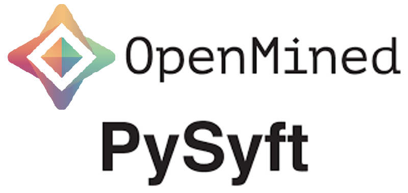

# Secure and Private AI

This course introduced me to three cutting-edge technologies for privacy-preserving AI: Federated Learning, Differential Privacy, and Encrypted Computation. I learned how to use the newest privacy-preserving technologies, such as OpenMined's PySyft. PySyft extends Deep Learning tools—such as PyTorch—with the cryptographic and distributed technologies necessary to safely and securely train AI models on distributed private data. PySyft decouples private data from model training, using [Federated Learning](https://ai.googleblog.com/2017/04/federated-learning-collaborative.html), [Differential Privacy](https://en.wikipedia.org/wiki/Differential_privacy), and [Multi-Party Computation (MPC)](https://en.wikipedia.org/wiki/Secure_multi-party_computation) within PyTorch.

<p align="center">
  
</p>

## Dependencies

To run these notebooks you'll need to install Python 3.6+, PySyft, Numpy, PyTorch 1.1.0, and Jupyter Notebooks. The easiest way to install the required libraries is with [Conda](https://docs.conda.io/projects/conda/en/latest/user-guide/overview.html) virtual environment. If you are using Windows, I suggest installing [Anaconda and using the Anaconda Prompt](https://docs.anaconda.com/anaconda/user-guide/getting-started/) to work from the command line.
Create a new environment, then install the dependencies in that environment. In your terminal:

```bash
conda create -n pysyft python=3
conda activate pysyft # some older version of conda require "source activate pysyft" instead.
conda install numpy jupyter notebook
conda install pytorch torchvision -c pytorch # depends
pip install syft
```

If you have an installation error regarding zstd, run this command and then re-try installing syft.

```bash
pip install --upgrade --force-reinstall zstd
```
If this still doesn't work, and you happen to be on OSX, make sure you have [OSX command line tools](https://railsapps.github.io/xcode-command-line-tools.html) installed and try again.

You can also install PySyft from source on a variety of operating systems by following this [installation guide](https://github.com/OpenMined/PySyft/blob/dev/INSTALLATION.md).

If you are using Windows, I suggest installing Anaconda and using the Anaconda Prompt to work from the command line.

With this environment activated and in the repo directory, launch Jupyter Notebook:

```jupyter notebook```
